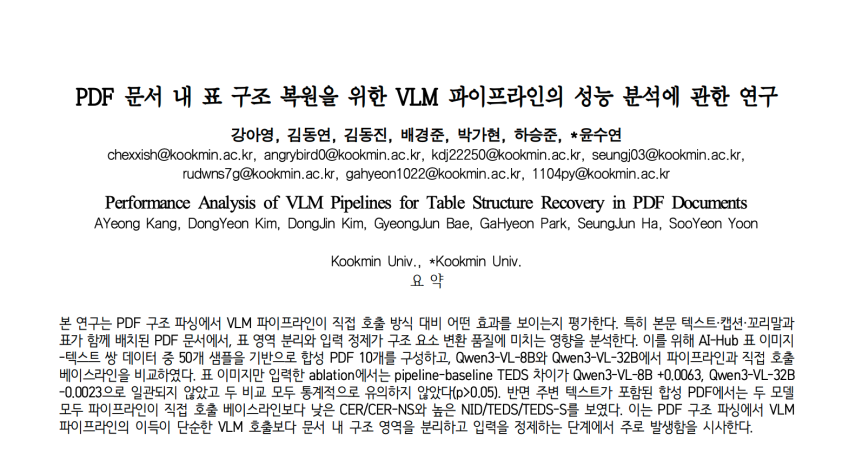
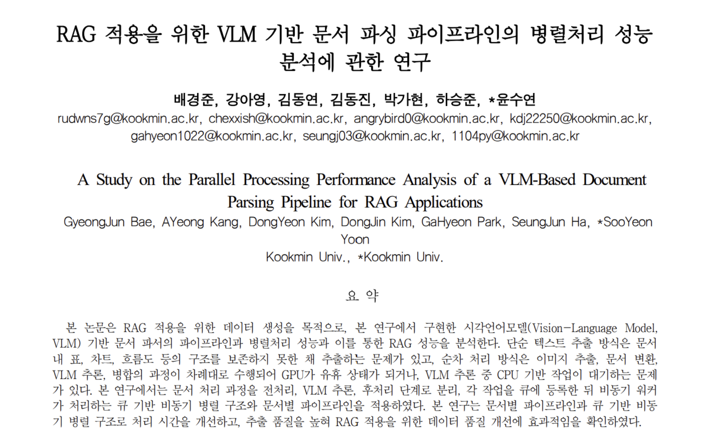

# LLMong

<div align="center">
  
  

  <br />
  <br />

  <strong>문서의 가치를 구조화하다.</strong>

  <p>
    LLMong은 HWP, PDF, 이미지, Excel 문서를 AI 기반으로 구조화하여
    RAG 검색과 질의응답에 활용 가능한 데이터로 변환하는 문서 파싱 서비스입니다.
  </p>

  <p>
    국민대학교 소프트웨어융합대학 2026 캡스톤디자인 23조 <strong>Durmon:t</strong><br />
    산학협력 프로젝트 협력: <strong>르몽</strong>
  </p>
</div>

<br />

## 프로젝트 페이지

[LLMong GitHub Pages 바로가기](https://kookmin-sw.github.io/2026-capstone-23/)

<br />

## 목차

1. [프로젝트 소개](#프로젝트-소개)
2. [팀원 소개](#팀원-소개)
3. [기술 스택](#기술-스택)
4. [주요 기능](#주요-기능)
5. [연구 성과](#연구-성과)
6. [시연 영상](#시연-영상)
7. [시스템 구조도](#시스템-구조도)
8. [폴더 구조](#폴더-구조)
9. [실행 가이드](#실행-가이드)
10. [비즈니스 모델](#비즈니스-모델)

<br />

## 프로젝트 소개

<p align="center">
  
</p>

LLMong은 복잡한 업무 문서를 단순 파일이 아닌 **검색 가능한 지식 데이터**로 변환하는 문서 AI 서비스입니다.

기존 업무 문서는 HWP, PDF, 스캔 이미지, 표, 차트, 수식처럼 형식과 레이아웃이 다양합니다. 일반적인 텍스트 추출만으로는 문서의 구조, 표의 의미, 이미지 설명, 메타데이터를 충분히 보존하기 어렵고, 그 결과 RAG 검색 또는 LLM 질의응답에 바로 활용하기 어렵습니다.

LLMong은 문서를 업로드하면 텍스트, 표, 이미지, 메타데이터를 추출하고, 이를 Markdown, HTML table, chunk, embedding 기반 검색 데이터로 변환하는 것을 목표로 합니다. 최종적으로 사용자는 업로드한 문서를 기반으로 자연어 검색과 질의응답을 수행할 수 있습니다.

### 핵심 처리 흐름

```text
문서 업로드
  ↓
비동기 변환 Job 생성
  ↓
문서 전처리 및 페이지 분석
  ↓
VLM/OCR 기반 텍스트, 표, 이미지 구조 추출
  ↓
결과 병합 및 Markdown/HTML/텍스트 변환
  ↓
chunk 및 embedding 생성
  ↓
RAG 검색 및 질의응답
```

<br />

## 팀원 소개
<table>
  <tr>
    <td align="center" width="180px">
      
      <br />
      <strong>김동연</strong>
      <br />
      PM & Full Stack
      <br />
      <a href="https://github.com/0yeonnnn0">GitHub</a>
    </td>
    <td align="center" width="180px">
      
      <br />
      <strong>강아영</strong>
      <br />
      AI
      <br />
      <a href="https://github.com/kaye0ng">GitHub</a>
    </td>
    <td align="center" width="180px">
      
      <br />
      <strong>김동진</strong>
      <br />
      Frontend
      <br />
      <a href="https://github.com/K-Dongjin">GitHub</a>
    </td>
    <td align="center" width="180px">
      
      <br />
      <strong>박가현</strong>
      <br />
      Backend
      <br />
      <a href="https://github.com/gahyeon1022">GitHub</a>
    </td>
    <td align="center" width="180px">
      
      <br />
      <strong>배경준</strong>
      <br />
      Backend
      <br />
      <a href="https://github.com/jun-kookmin">GitHub</a>
    </td>
    <td align="center" width="180px">
      
      <br />
      <strong>하승준</strong>
      <br />
      Backend & AI
      <br />
      <a href="https://github.com/seunG-Zzun">GitHub</a>
    </td>
  </tr>
</table>

<br />

## 기술 스택

### Frontend

<p>
  
  
  
  
  
  
  
  
  
  
  
  
</p>

### Backend

<p>
  
  
  
  
  
</p>

### AI

<p>
  
  
  
</p>

### Deployment

<p>
  
  
  
  
</p>

### Collaboration

<p>
  
  
  
</p>

<br />

## 주요 기능

### 1. AI 문서 파싱 및 변환

- HWP/HWPX, PDF, Excel, CSV, PNG, JPG, BMP, TIFF 파일 업로드
- 텍스트, 표, 이미지, 메타데이터 추출
- 표 이미지를 HTML table 및 Markdown table 형태로 구조화
- 차트, 플로우차트, 수식 이미지에 대한 설명형 텍스트 생성
- 변환 결과 미리보기 및 다운로드

### 2. 비동기 Job 기반 처리

- 문서 변환 요청을 Job 단위로 생성
- 작업 상태를 `queued -> processing -> done -> failed` 흐름으로 추적
- 대용량 문서 처리를 위한 큐 기반 워커 구조
- 실패 작업에 대한 에러 로그와 상태 확인
- GPU 추론 동시성을 제한해 VRAM 초과 방지

### 3. 문서 관리 대시보드

- 전체 처리 건수, 성공/실패/진행 중 Job 통계
- 최근 문서 처리 목록 확인
- 파일 타입별 처리 현황 확인
- 작업 실패 로그 및 시스템 상태 확인

### 4. RAG 질의응답

- 변환된 문서를 chunk 단위로 분리
- embedding 기반 검색 데이터 생성
- 문서 기반 질문 세션 생성
- 관련 문맥을 검색한 뒤 LLM 답변 생성
- 원문 문서의 텍스트, 표, 이미지 설명을 답변 근거로 활용

### 5. API 연동 구조

프론트엔드는 `/api/v1`을 기본 API base URL로 사용합니다. 백엔드 응답은 다음 래퍼 구조를 기준으로 처리합니다.

```json
{
  "success": true,
  "data": {},
  "error": null
}
```

주요 API 흐름은 다음과 같습니다.

```text
POST   /parser/jobs
GET    /parser/jobs/{jobId}
GET    /parser/jobs/{jobId}/items
POST   /parser/jobs/{jobId}/cancel
GET    /documents
GET    /documents/{documentId}/result
POST   /rag/sessions
POST   /rag/sessions/{sessionId}/messages
```

<br />

## 연구 성과

LLMong 프로젝트의 문서 파싱 및 RAG 기반 문서 질의응답 구조를 정리한 논문을 <strong>KICS(한국통신학회)</strong>에 투고

<p align="center">
  
  
</p>

<br />

## 시연 영상

프로젝트 시연 영상은 아래 링크에서 확인할 수 있습니다.

<p align="center">
  <a href="https://www.youtube.com/watch?v=txJgsCJVvJk">
    
  </a>
</p>

[시연 영상 바로가기](https://www.youtube.com/watch?v=txJgsCJVvJk)

### 주요 화면

| 문서 변환 | 변환 결과 확인 | RAG 질의응답 |
| --- | --- | --- |
|  |  |  |


<br />

## 시스템 구조도

<p align="center">
  
  
</p>

### Architecture

```text
Client
  |
  v

React Frontend
  - 문서 업로드
  - Job 상태 조회
  - 변환 결과 미리보기
  - RAG 질의응답 UI
  |
  v

API Gateway / Backend
  |
  v

FastAPI
  - 인증 및 사용자 요청 처리
  - /parser/jobs
  - /documents
  - /rag/sessions
  |
  v

Queue / Status
  |
  v

RabbitMQ + Redis
  - 작업 큐
  - 진행 상태 캐시
  - 실패/재시도 관리
  |
  v

Worker
  |
  v

Document Parser / VLM Inference
  - 문서 전처리
  - Qwen2.5-VL 추론
  - 표/이미지/텍스트 구조화
  |
  v

Storage / RAG
  - 원본 문서
  - 변환 결과
  - chunk
  - embedding
  |
  v

Answer
  - 검색 문맥 기반 답변 생성
  |
  v

Client
```

### 처리 상태

```text
queued
  |
  v
processing
  |
  +--> done
  |
  +--> failed
         |
         v
    retry 또는 사용자 확인
```

<br />

## 폴더 구조

현재 공개 레포지토리 기준 구조입니다.

```text
2026-capstone-23/
  README.md
  index.html
  _config.yml

  assets/
    css/
      member-cards.css
    images/
      architecture-dark.svg
      architecture.svg
      banner.svg
      convert.svg
      convertdoc.svg
      dashboard.svg
      dashboarddoc.svg
      logo-dark.svg
      logo.svg
      model.svg
      pipeline.svg
      poster.svg
      rag.svg
      rag2.svg
      readme-banner.gif
      service1.svg
      service2.svg
      service3.svg
      show.svg

  backend/
    Dockerfile
    docker-compose.yml
    docker-compose.onprem.yml
    requirements.txt
    requirements-dev.txt
    requirements-torch.txt
    requirements-qwen.txt
    api/
    core/
    db/
    docs/
    infra/
    models/
    storage/
    tests/
    worker/

  frontend/
    Dockerfile
    nginx.conf
    package.json
    package-lock.json
    vite.config.ts
    tsconfig.json
    playwright.config.ts
    docs/
    e2e/
    src/
      app/
      entities/
      features/
      pages/
      routes/
      shared/
      widgets/
```

### Frontend Architecture

프론트엔드는 Feature-Sliced Design 구조를 따릅니다.

| 디렉터리 | 역할 |
| --- | --- |
| `app/` | 앱 초기화, provider, 전역 스타일, 전역 store |
| `pages/` | 라우트 단위 화면 |
| `widgets/` | 대시보드, 문서 뷰어, 사이드바 등 큰 UI 블록 |
| `features/` | 파일 업로드, AI 채팅, 인증 등 사용자 행동 단위 기능 |
| `entities/` | document, rag, parser, session 등 도메인 데이터 |
| `shared/` | 공통 API client, UI 컴포넌트, 타입, 유틸리티 |
| `routes/` | TanStack Router 라우트 정의 |

<br />

## 실행 가이드

### 실행 가능 범위 안내

로컬에서 전체 기능을 사용하려면 `backend/.env`에 OpenAI/OpenRouter API 키를 설정하거나, 온프레미스 Qwen 실행을 위한 모델 디렉터리를 별도로 준비해야 합니다.

### 1. 프로젝트 소개 페이지

LLMong 주소

[https://kookmin-sw.github.io/2026-capstone-23/](https://kookmin-sw.github.io/2026-capstone-23/)

Windows PowerShell:

```powershell
cd 2026-capstone-23
Start-Process .\index.html
```

### 2. Backend 로컬 실행 - Docker Compose 권장

필수 환경:

```text
Docker Desktop
Docker Compose
```

환경 변수 파일을 준비합니다.

```powershell
cd backend
Copy-Item .env.example .env
notepad .env
```

`.env`에서 최소한 아래 값은 실제 값으로 교체합니다.

```env
ADMIN_ID=admin
ADMIN_PW=change-me-admin-password
ADMIN_UI_SECRET_KEY=change-me-admin-ui-secret

OPENROUTER_API_KEY=your_openrouter_api_key
OPENAI_API_KEY=your_openai_api_key
```

백엔드, worker, Redis, RabbitMQ를 함께 실행합니다.

```powershell
docker compose up -d --build
```

접속 정보:

```text
Backend API:       http://localhost:8000
Swagger:           http://localhost:8000/docs
Health:            http://localhost:8000/v1/health
RabbitMQ UI:       http://localhost:15672
RabbitMQ account:  luminir / luminir-local-password
```

상태와 로그 확인:

```powershell
docker compose ps
docker compose logs -f backend
docker compose logs -f worker-openai
```

중지:

```powershell
docker compose down
```

포트가 이미 사용 중이면 `backend/.env`에 아래 값을 추가해 변경합니다.

```env
BACKEND_PORT=8001
REDIS_PORT=6380
RABBITMQ_PORT=5673
RABBITMQ_MANAGEMENT_PORT=15673
```

### 3. Backend 로컬 실행 - Python 직접 실행

Docker 없이 API 서버만 빠르게 확인할 때 사용할 수 있습니다. 문서 변환 Job까지 로컬 단일 프로세스로 확인하려면 memory queue를 사용합니다.

Windows PowerShell:

```powershell
cd backend
py -3.12 -m venv .venv
.\.venv\Scripts\Activate.ps1
python -m pip install --upgrade pip setuptools wheel
pip install -r requirements.txt -c requirements-torch.txt

Copy-Item .env.example .env
notepad .env

$env:QUEUE_BACKEND="memory"
$env:STORE_BACKEND="sqlite"
$env:STATUS_CACHE_BACKEND=""
$env:QUEUE_MEMORY_FALLBACK_ENABLED="1"

python -m uvicorn api:app --host 127.0.0.1 --port 8000 --reload
```

Linux/macOS:

```bash
cd backend
python3.12 -m venv .venv
source .venv/bin/activate
python -m pip install --upgrade pip setuptools wheel
pip install -r requirements.txt -c requirements-torch.txt

cp .env.example .env

QUEUE_BACKEND=memory \
STORE_BACKEND=sqlite \
STATUS_CACHE_BACKEND= \
QUEUE_MEMORY_FALLBACK_ENABLED=1 \
python -m uvicorn api:app --host 127.0.0.1 --port 8000 --reload
```

확인:

```text
http://localhost:8000/docs
http://localhost:8000/v1/health
```

### 4. Frontend 로컬 실행

필수 환경:

```text
Node.js 22 계열 권장
npm
```

실행:

```powershell
cd frontend
npm install
npm run dev
```

접속:

```text
http://localhost:5173
```

프론트엔드는 기본 API base URL로 `/api/v1`을 사용합니다. 로컬 개발 서버는 `/api/*` 요청을 `http://localhost:8000/*`로 프록시하므로, 백엔드가 `8000` 포트에서 실행 중이면 별도 설정 없이 연동됩니다.

백엔드 포트를 `8001`처럼 바꾼 경우 `frontend/vite.config.ts`의 proxy target도 같은 포트로 수정해야 합니다.

### 5. 검증 명령

Frontend:

```powershell
cd frontend
npm run lint
npm run test
npm run build
```

Backend:

```powershell
cd backend
.\.venv\Scripts\Activate.ps1
pip install -r requirements-dev.txt
python -m ruff check .
python -m pytest tests
docker compose config --quiet
docker compose -f docker-compose.onprem.yml config --quiet
```

<br />

## 비즈니스 모델

LLMong은 문서 AI 전환과 RAG 기반 문서 질의응답이 필요한 기업과 기관을 대상으로 하는 **문서 파싱 AI 플랫폼**으로 확장할 예정입니다. 기업 내부 문서를 검색 가능한 지식 데이터로 구조화하고, 사용자가 자연어로 질문해 근거 기반 답변을 받을 수 있도록 지원하는 방향을 목표로 합니다.

대상 고객은 HWP/PDF 기반 내부 문서가 많은 기업, 문서 검색과 사내 지식 질의응답을 도입하려는 조직, 보안상 외부 LLM 서비스 사용이 어려운 공공기관·금융·의료 분야입니다.

향후 수익 모델은 세 가지 방향으로 구상하고 있습니다.

- **SaaS 구독형 서비스**: 중소기업과 스타트업이 별도 인프라 없이 문서 업로드, 변환, 검색, RAG 질의응답을 사용할 수 있도록 월/연 구독 방식으로 제공할 예정입니다.
- **온프레미스 구축형 서비스**: 공공기관, 금융, 의료처럼 보안이 중요한 조직을 대상으로 내부 서버나 폐쇄망 설치를 지원하고, 라이선스와 구축비, 유지보수 비용을 수익화하는 방향을 고려하고 있습니다.
- **B2B API 제공**: 자체 서비스나 업무 시스템에 문서 파싱, 구조화, RAG 질의 기능을 붙일 수 있도록 API를 제공하고, 문서 수, 페이지 수, 호출 수, 질의 요청 수 기준의 사용량 과금을 계획하고 있습니다.

기대하는 고객 가치는 문서 검색 시간 단축, 업무 효율 향상, 보안 환경에서의 AI 활용입니다.
